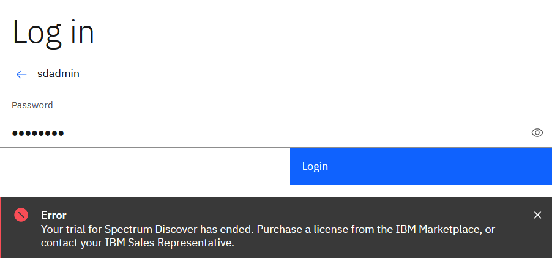
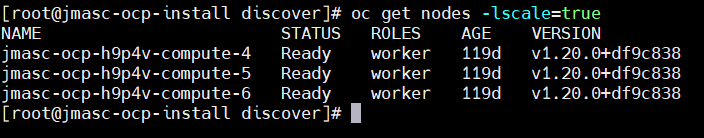

## OpenShift registry must be configured correctly and exposed:
https://docs.openshift.com/container-platform/4.8/registry/configuring_registry_storage/configuring-registry-storage-vsphere.html
https://docs.openshift.com/container-platform/4.8/registry/securing-exposing-registry.html


# Create Storage PVC
```
kind: PersistentVolumeClaim
apiVersion: v1
metadata:
  name: image-registry-storage
  namespace: openshift-image-registry
spec:
  storageClassName: ibm-spectrum-scale-csi-remote-fileset
  accessModes:
  - ReadWriteMany
  resources:
    requests:
      storage: 100Gi

```

# Edit image-registry-config
```
oc edit config.imageregistry.operator.openshift.io -o yaml
pvc: image-registry-storage
```

# Modify the configuration from Removed to Managed

```
oc get configs.imageregistry.operator.openshift.io cluster -oyaml | grep manage
```
Output:
  managedFields:
        f:managementState: {}
    manager: cluster-image-registry-operator
    manager: kubectl-patch
  managementState: Removed

```
oc patch configs.imageregistry.operator.openshift.io cluster --type merge --patch '{"spec":{"managementState":"Managed"}}'
oc get configs.imageregistry.operator.openshift.io cluster -oyaml | grep manage
```
Output:
  managedFields:
    manager: cluster-image-registry-operator
        f:managementState: {}
    manager: kubectl-patch
  managementState: Managed

# Check Status
```
oc get clusteroperator image-registry
```
## Configure the image registry settings

```
HOST=$(oc get route default-route -n openshift-image-registry --template='{{ .spec.host }}')
# Use the following output for external route in the next step:
echo $HOST
```

```
oc edit image.config.openshift.io/cluster
```
spec:
  registrySources:
    insecureRegistries:
    - default-route-openshift-image-registry.apps.ocp.vsphere.local


## Service Mesh
```
oc edit smmr default -n istio-system
```

## Licences Error

```
oc logs spectrum-discover-generate-license-6w5zb
```

```
TASK [license : Call REST endpoint] ********************************************
task path: /opt/ibm/metaocean/roles/license/tasks/k8s_api_call.yaml:16
<127.0.0.1> ESTABLISH LOCAL CONNECTION FOR USER: root
<127.0.0.1> EXEC /bin/sh -c 'echo ~root && sleep 0'
<127.0.0.1> EXEC /bin/sh -c '( umask 77 && mkdir -p "` echo /root/.ansible/tmp `"&& mkdir "` echo /root/.ansible/tmp/ansible-tmp-1635997435.0037742-36-137984253230374 `" && echo ansible-tmp-1635997435.0037742-36-137984253230374="` echo /root/.ansible/tmp/ansible-tmp-1635997435.0037742-36-137984253230374 `" ) && sleep 0'
Using module file /usr/local/lib/python3.6/site-packages/ansible/modules/net_tools/basics/uri.py
<127.0.0.1> PUT /opt/app-root/src/.ansible/tmp/ansible-local-7rdbk5eb6/tmp9ayk7bjh TO /root/.ansible/tmp/ansible-tmp-1635997435.0037742-36-137984253230374/AnsiballZ_uri.py
<127.0.0.1> EXEC /bin/sh -c 'chmod u+x /root/.ansible/tmp/ansible-tmp-1635997435.0037742-36-137984253230374/ /root/.ansible/tmp/ansible-tmp-1635997435.0037742-36-137984253230374/AnsiballZ_uri.py && sleep 0'
<127.0.0.1> EXEC /bin/sh -c '/usr/bin/python3.6 /root/.ansible/tmp/ansible-tmp-1635997435.0037742-36-137984253230374/AnsiballZ_uri.py && sleep 0'
<127.0.0.1> EXEC /bin/sh -c 'rm -f -r /root/.ansible/tmp/ansible-tmp-1635997435.0037742-36-137984253230374/ > /dev/null 2>&1 && sleep 0'
fatal: [localhost]: FAILED! => {
    "msg": "The conditional check '('reason' in result.json)' failed. The error was: error while evaluating conditional (('reason' in result.json)): 'dict object' has no attribute 'json'"
}

PLAY RECAP *********************************************************************
localhost
```

# Fix

```
INGRESSHOST=$(oc get route -n istio-system | grep spectrum-discover | awk '{print $2}')
echo $INGRESSHOST
# spectrum-discover-ingress.apps.ocp.vsphere.local
TOKEN=$(curl -ks -u sdadmin:Passw0rd https://$INGRESSHOST/auth/v1/token -I | awk '/X-Auth-Token/ {print $2}')
```
```
oc delete po spectrum-discover-generate-license-6w5zb
```

```
for po in `oc get po -n spectrum-discover | grep license | awk '{print $1}'`;do oc delete po $po; done
```

# GUI Trial Error
The login error is as follows:



