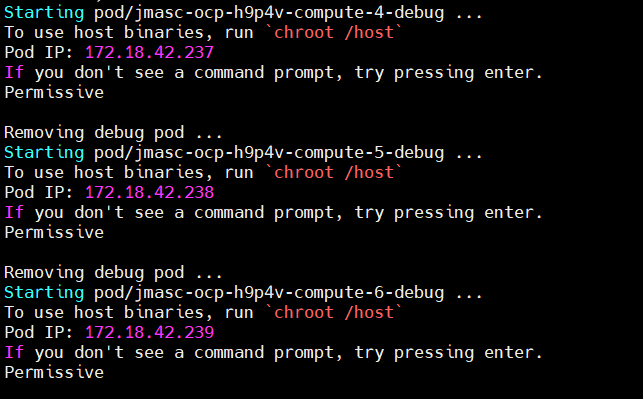

# Installing IBM Spectrum Discover with Spectrum Scale CNSA


## Note: These steps are intended as a supplement to the IBM Documentation found here:
https://www.ibm.com/docs/en/spectrum-discover/2.0.4?topic=configuring-deploy-spectrum-discover-red-hat-openshift

## Step 1: Preparing the OpenShift Cluster

1. Install IBM Spectrum Scale Container Native Storage Access (CNSA) 5.1.1.3

   For details on this process, please see the IBM documentation here:
   https://www.ibm.com/docs/en/scalecontainernative?topic=spectrum-scale-container-native-storage-access-5113

2. Verify IBM Spectrum Scale CSI Driver is at level V2.3.0 

   This is now automatically installed during the CNSA installation. For additional information the IBM Spectrum Scale CSI driver, please see: 
   https://www.ibm.com/docs/en/spectrum-scale-csi?topic=spectrum-scale-container-storage-interface-driver-230

3. If you have labeled nodes for Spectrum Scale, validate this from the OpenShift command line as follows"
    ```
    oc get nodes -lscale=true
    ```

4. You must disable SE Linux for the OpenShift worker nodes where IBM Spectrum Scale will run. The command is as follows:
    ```
    for node in `oc get node --no-headers -lscale=true | awk '{print $1}'`; do oc debug node/$node -T -- chroot /host sh -c "sudo setenforce 0"; done
    ```
    You can verify with the following command:
    ```
    for node in `oc get node --no-headers -lscale=true | awk '{print $1}'`; do oc debug node/$node -T -- chroot /host sh -c "sudo getenforce"; done
    
    ```
    You should see output similar to the following:

    

## Step 2: Install Spectrum Discover, using the modified procedure for installing Helm and using the provided storage definitions for IBM Spectrum Scale
The documentation for IBM Spectrum Discover on OpenShift can be found here:
https://www.ibm.com/docs/en/spectrum-discover/2.0.4?topic=configuring-deploy-spectrum-discover-red-hat-openshift


In step #2 of the documentation, there are issues with the procedure to install Helm. The following procedure has been corrected to use Helm v2.17.0 and tested with IBM Spectrum Scale: [Click here for the installation procedure](tiller-installation\tiller-installation-steps.md)

In step #4 of the documentation, you can use the StorageClass and Persistent Volume Claim definitions provided here.
If you have cloned this repository, you can create the assets using the following command:
```
oc create -f spectrum-discover-install/spectrum-scale/
```

